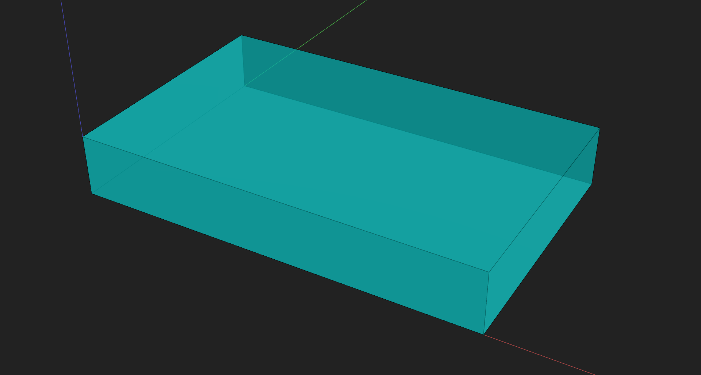
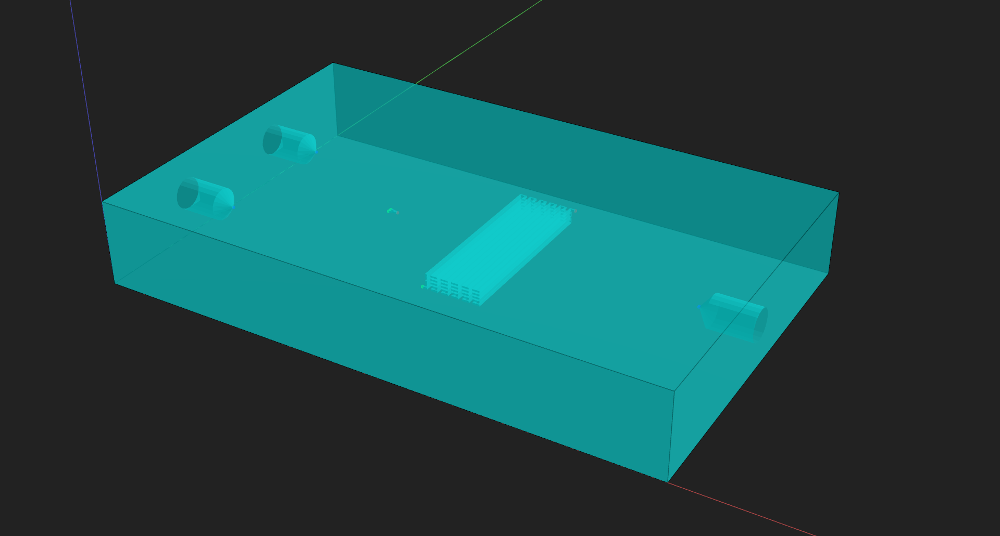
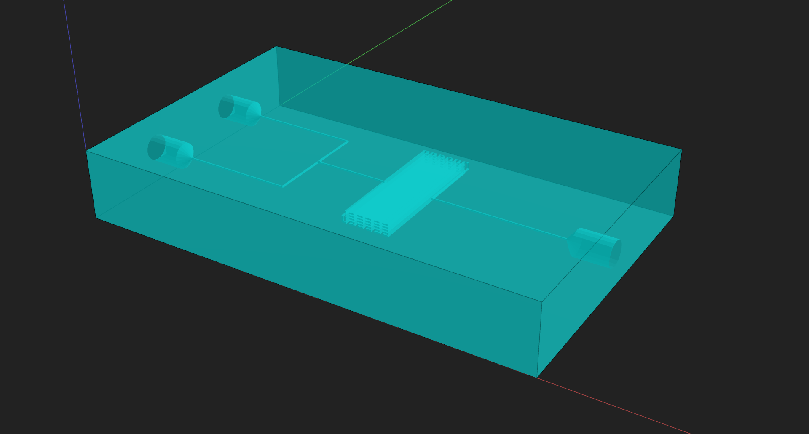

# Using Components in a Device

Prev: [Part 9: Routing with Fractional Paths](9-routing-fractional.md)

This step shows how to assemble a full device from **subcomponents**, apply **component operations**, and use **autoroute** when you don’t need strict path control.

We’ll build a device with:

- Two **inlet pinholes** feeding a **Y‑junction**
- A **serpentine** between the Y‑junction and the outlet
- One **outlet pinhole**

---

## Component operations (quick recap)

Subcomponents are just components placed inside a larger device. You can transform them before adding them:

- `translate((x, y, z))` moves the component
- `rotate(x)` rotates it in degrees (multiples of 90)
- `mirror(mirror_x, mirror_y)` mirrors it across axes

These operations make it easy to reuse the same component in multiple orientations.

---

## Step 1 — Device context

    

    

Preview the empty device canvas.

---

## Step 2 — Add subcomponents (pinholes, Y‑junction, serpentine)

`Pinhole` is a **prebuilt** component from `pymfcad.component_library` that provides a standardized access port geometry. We’ll reuse it for the two inlets and one outlet.

At this stage you are only placing components in space; the channels that connect them will be routed in the next step.

    

    

Preview component placement before routing.

---

## Step 3 — Autoroute between ports

If you don’t need strict control of the path, **autoroute** is faster and cleaner. You can also set a **direction preference** to bias the search (for example, prefer X‑moves before Y‑moves).

    

    

Preview the routed device. 

---

## Full example

    

    

---

## Notes

- Use **subcomponents** to build devices from reusable building blocks.
- **Autoroute** is ideal when path shape is not critical.
- Use `direction_preference=("X", "Y", "Z")` to bias routing order.

---

## Next

Next: [Part 11: Full Device Assembly](11-full-device.md)