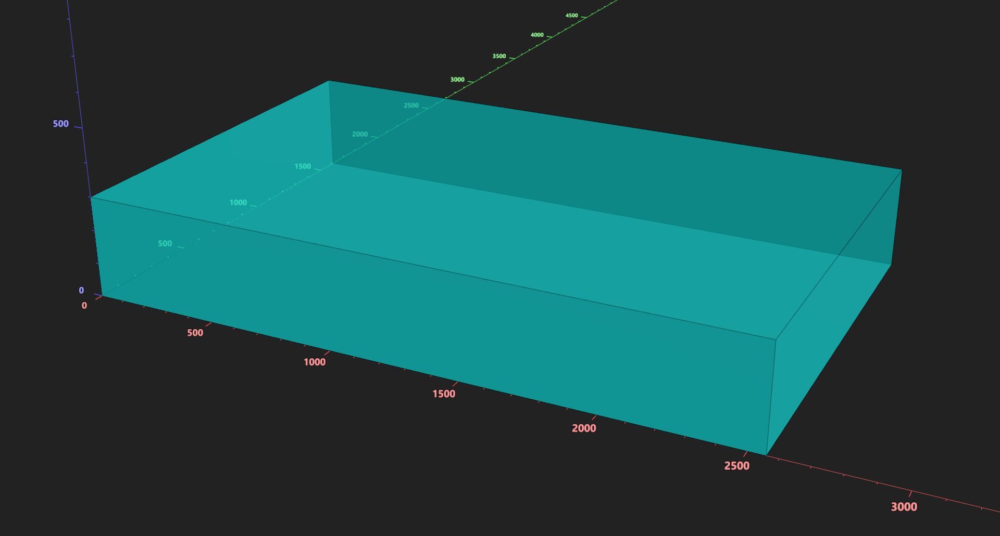
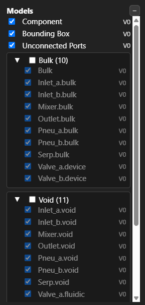
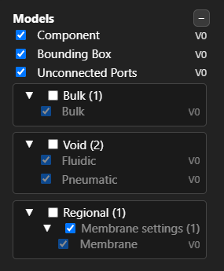
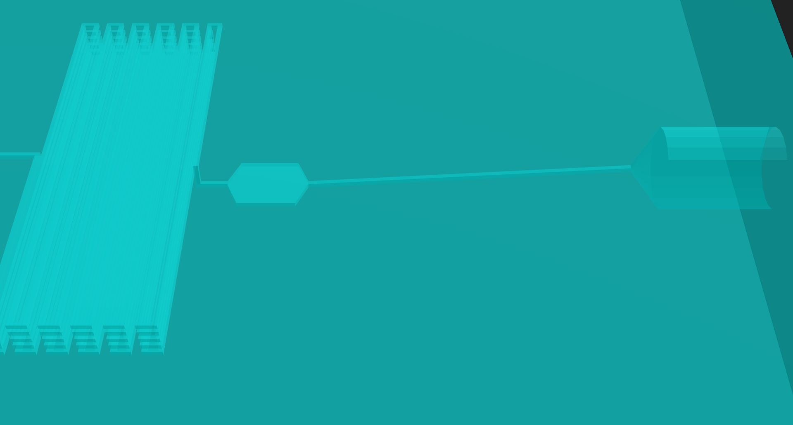
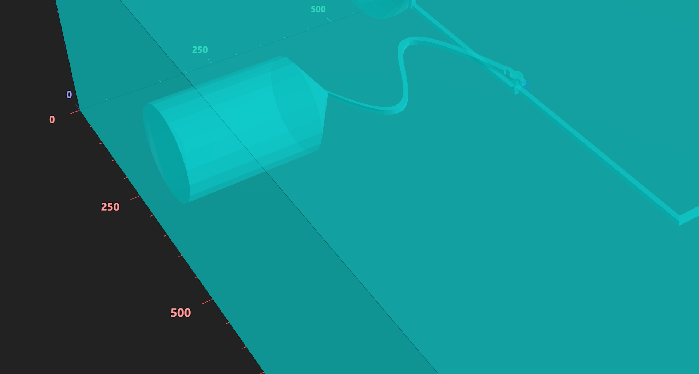
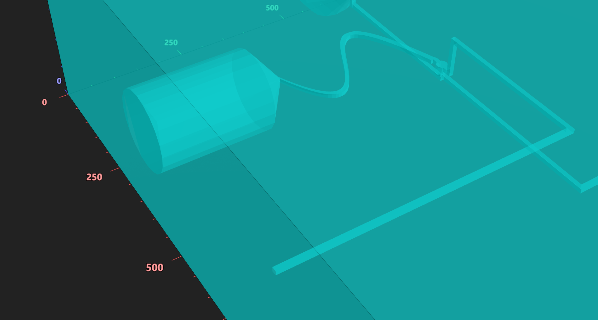
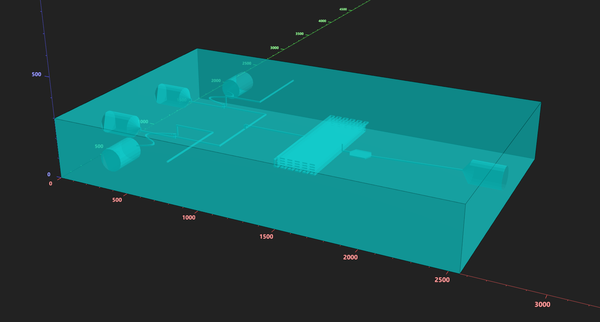

# Full Device Assembly

Prev: [Part 10: Using Components in a Device](10-using-components.md)

This final modeling step builds a **complete microfluidic device** and introduces advanced techniques:

- **Bezier curve routing**
- **Polychannel routing**
- **Stubbing** unused ports
- **Relabeling** subcomponent labels
- **Rendering** to a file

Device plan:

- Two **inlets** → **20 px valves** → **Y‑junction mixer**
- Mixer output → **serpentine** → **expanded viewing area** → **outlet pinhole**
- Each valve control line connects to a **pinhole** on one side and a **stubbed external port** on the other

---

## Step 1 — Component context + labels + bulk

    

    

Preview the bulk block.

---

## Step 2 — Add subcomponents

    

    

Preview the device at this stage.

---

## Step 3 — Relabel subcomponents

Subcomponents bring their own labels (and colors). If you leave them as‑is, you’ll end up with many label names like `valve_a.pneumatic` or `mixer.void`. Use `relabel()` to **merge and normalize** those labels into a small, consistent component‑level set (e.g., `fluidic`, `pneumatic`, `membrane`, `bulk`).

This keeps the visualizer clean and makes downstream settings (like slicer regions) much easier to manage.

For more information see [Extra 1: Customizing Subcomponent Labels and Colors](e1-recoloring_components.md)

    

    

Preview again to confirm labels after relabeling.

### Before

### After

---

## Step 4 — Route fluidics (autoroute)

`route_with_polychannel()` is just like regular polychannel construction, **but the router automatically inserts the start and end port cross‑sections** for you. You only need to describe the shapes in between. It can be used when more advanced routing with multiple cross-sectional shapes/sizes are needed.

    

    

Preview the device after autorouting.

---

## Step 5 — Polychannel routing (expanded viewing area)

This step creates a wider viewing region after the serpentine using a polychannel.

    

    

Preview the device after polychannel routing.

---

## Step 6 — Pneumatic control lines (Bezier routing)

While there’s no functional requirement to use Bezier curves here, we use them simply to **introduce the technique**. Bezier routing is helpful when you want smooth curves or graceful detours.

    

    

Preview the device after Bezier routing.

---

## Step 7 — Add external flushing ports (autoroute only)

First add the external ports and autoroute the connections

    

    

Preview the device after adding the external ports.

---

## Step 8 — Stub unused ports

If a port exists but isn’t used in this build, or is only used internally like the flushing channes, **stub** them so they don’t appear as unconnected.

    

    

Preview the device after stubbing.

---

## Step 9 — Render device

Rendering exports the device as a **portable 3D model file** so it can be used outside the pymfcad ecosystem. Any component can be rendered. The output is the final **bulk‑void** model, ready for other CAD tools and manufacturing pipelines. We support common formats like **.glb**, **.stl**, and **.3mf**, so your design works across most 3D workflows without relying on our custom printers. Advanced settings (which we will introduce shortly), will not be exported.

    

    

---

## Full example

    

    

---

## Notes

- **Bezier routing** is great for pneumatic lines and smooth curves.
- **Polychannel routing** lets you expand or taper channels mid‑path.
- **Relabeling** keeps all geometry under a small, consistent set of labels.
- **Stubbing** hides unused ports without deleting them.

---

## Next

Next: [Part 12: Slicing Introduction](12-slicing-introduction.md)