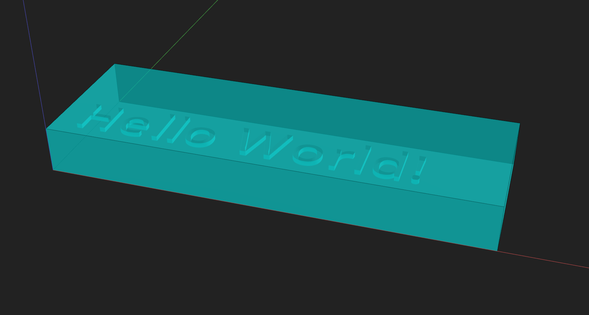

# Creating Your First Component

Prev: [Part 3: Using the Visualizer](3-visualizer.md)

This quick “hello world” tutorial builds a minimal component and previews it in the visualizer.

Goal: create a component, label it, and confirm that it renders.

---

## Step 1 — Import PyMFCAD

```python
import pymfcad
```

---

## Step 2 — Create a component

Components are sized in **pixels (x/y)** and **layers (z)**. You also define the physical resolution with `px_size` and `layer_size` (mm).

```python
component = pymfcad.Component(
    size=(120, 40, 10), # X pixel count, Y pixel count, Z layer count
    position=(0, 0, 0),
    px_size=0.0076,
    layer_size=0.01,
)
```

---

## Step 3 — Add labels

Labels are named color groups used for visualization and organization.

```python
component.add_label("default", pymfcad.Color.from_rgba((0, 255, 0, 255)))
component.add_label("bulk", pymfcad.Color.from_name("aqua", 127))
```

---

## Step 4 — Add a simple void

```python
hello = pymfcad.TextExtrusion("Hello World!", height=1, font_size=15)
hello.translate((5, 5, 9))
component.add_void("hello", hello, label="default")
```

---

## Step 5 — Add bulk

```python
bulk_cube = pymfcad.Cube((120, 40, 10))
component.add_bulk("bulk_shape", bulk_cube, label="bulk")
```

---

## Step 6 — Preview

```python
component.preview()
```

You should see a solid block with the “Hello World” void cut out.



---

## Checkpoint
Ensure that:
- You can preview the component without errors.
- You can see the text void in the visualizer.

## Next

Next: [Part 5: Modeling Introduction](5-modeling-introduction.md)

