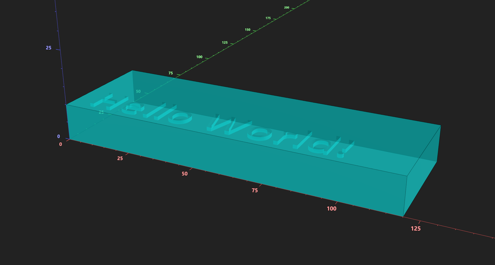

# Creating Your First Component

Prev: [Part 4a: Reading Code Examples](4a-reading-code-examples.md)

This quick “hello world” tutorial builds a minimal component and previews it in the visualizer.

You don’t need to understand the code yet—we’ll explain what each part does in later sections. The goal here is simply to create your first file, run it with Python, and confirm that everything is working end‑to‑end.

Goal: create a component, generate the visualizer output files, and confirm that it renders.

---

In your code editor of choice, copy in the following code.

## Step 1 — Import PyMFCAD

<div class="diff2html-wrapper">
    <div class="diff2html"></div>
    <script type="text/plain" class="diff2html-source">
diff --git a/example_device.py b/example_device.py
index 0000000..1111111 100644
--- a/example_device.py
+++ b/example_device.py
@@ -0 +1 @@
+import pymfcad
    </script>
</div>

---

## Step 2 — Create a component

Components are sized in **pixels (x/y)** and **layers (z)**. You also define the physical resolution with `px_size` and `layer_size` (mm).

<div class="diff2html-wrapper">
    <div class="diff2html"></div>
    <script type="text/plain" class="diff2html-source">
diff --git a/example_device.py b/example_device.py
index 0000000..1111111 100644
--- a/example_device.py
+++ b/example_device.py
@@ -1 +1 @@
 import pymfcad
+
+component = pymfcad.Component(
+    size=(120, 40, 10), # X pixel count, Y pixel count, Z layer count
+    px_size=0.0076,
+    layer_size=0.01,
+)
    </script>
</div>

---

## Step 3 — Add labels

Labels are named color groups used for visualization and organization.


<div class="diff2html-wrapper">
    <div class="diff2html"></div>
    <script type="text/plain" class="diff2html-source">
diff --git a/example_device.py b/example_device.py
index 0000000..1111111 100644
--- a/example_device.py
+++ b/example_device.py
@@ -3 +3 @@
 component = pymfcad.Component(
     size=(120, 40, 10), # X pixel count, Y pixel count, Z layer count
     px_size=0.0076,
     layer_size=0.01,
 )
+
+component.add_label("default", pymfcad.Color.from_rgba((0, 255, 0, 255)))
+component.add_label("bulk", pymfcad.Color.from_name("aqua", 127))
    </script>
</div>

---

## Step 4 — Add a simple void

<div class="diff2html-wrapper">
    <div class="diff2html"></div>
    <script type="text/plain" class="diff2html-source">
diff --git a/example_device.py b/example_device.py
index 0000000..1111111 100644
--- a/example_device.py
+++ b/example_device.py
@@ -10 +10 @@
 component.add_label("default", pymfcad.Color.from_rgba((0, 255, 0, 255)))
 component.add_label("bulk", pymfcad.Color.from_name("aqua", 127))
+
+hello = pymfcad.TextExtrusion("Hello World!", height=1, font_size=15)
+hello.translate((5, 5, 9))
+component.add_void("hello", hello, label="default")
    </script>
</div>

---

## Step 5 — Add bulk

<div class="diff2html-wrapper">
    <div class="diff2html"></div>
    <script type="text/plain" class="diff2html-source">
diff --git a/example_device.py b/example_device.py
index 0000000..1111111 100644
--- a/example_device.py
+++ b/example_device.py
@@ -13 +13 @@
 hello = pymfcad.TextExtrusion("Hello World!", height=1, font_size=15)
 hello.translate((5, 5, 9))
 component.add_void("hello", hello, label="default")
+
+bulk_cube = pymfcad.Cube((120, 40, 10))
+component.add_bulk("bulk_shape", bulk_cube, label="bulk")
    </script>
</div>
---

## Step 6 — Preview

<div class="diff2html-wrapper">
    <div class="diff2html"></div>
    <script type="text/plain" class="diff2html-source">
diff --git a/example_device.py b/example_device.py
index 0000000..1111111 100644
--- a/example_device.py
+++ b/example_device.py
@@ -17 +17 @@
 bulk_cube = pymfcad.Cube((120, 40, 10))
 component.add_bulk("bulk_shape", bulk_cube, label="bulk")
+
+component.preview()
    </script>
</div>

---

## Step 7 — Run the script

Save your file as `example_device.py`, then run it from a terminal:

```
python example_device.py
```

or if using uv:

```
uv run example_device.py
```

Running the script executes `component.preview()`, which writes the visualizer output into your current working directory (CWD). The visualizer will automatically load these files when it is opened from the same CWD.

By default, `preview()` writes to the `_visualization/` directory. You can change the output location with `preview("YOUR_DIRECTORY_HERE")`. If you do change the output folder, the visualizer will not auto-detect it; use File → Open to select the new directory manually.

You should see a solid block with the “Hello World” void cut out.



---

## Notes:

- **You cannot run a Python file from the visualizer. Run it with your Python interpreter to generate the .glb files the visualizer reads. Every time you change your code, you must re-run it with python view the changes in the visualizer.**
- Each run overwrites the target preview directory, even if it already exists. If you want to keep multiple outputs (for multiple Python files/component designs), specify a different `preview_dir` for each.
- If your file is in a folder, run it like this:
    ```
    python YOUR_FOLDER_NAME/YOUR_FILE_NAME.py
    ```
- If you are importing your own custom modules, you may have a slightly different file structure and may need to use Python’s module system:

    Example folder structure:

    - pymfcad_code/  
    ├── projects/  
    │   └── test_device/  
    │       ├── \_\_init\_\_.py  
    │       └── example_device.py  
    └── components/  
        ├── \_\_init\_\_.py  
        └── test_component.py  

    The `test_component.py` file can define one or more components (e.g., `MyComponent`).

    Import custom components in your code (example_device.py):
    ```
    from components import MyComponent
    ```

    Run from `pymfcad_code` folder:
    ```
    python -m projects.test_device.example_device
    ```

    or if using uv:

    ```
    uv run -m projects.test_device.example_device
    ```

---

## Full example

<div class="diff2html-wrapper">
    <div class="diff2html"></div>
    <script type="text/plain" class="diff2html-source">
diff --git a/example_device.py b/example_device.py
index 0000000..1111111 100644
--- a/example_device.py
+++ b/example_device.py
@@ -1 +1 @@
 import pymfcad
 
 component = pymfcad.Component(
     size=(120, 40, 10), # X pixel count, Y pixel count, Z layer count
     px_size=0.0076,
     layer_size=0.01,
 )
 
 component.add_label("default", pymfcad.Color.from_rgba((0, 255, 0, 255)))
 component.add_label("bulk", pymfcad.Color.from_name("aqua", 127))
 
 hello = pymfcad.TextExtrusion("Hello World!", height=1, font_size=15)
 hello.translate((5, 5, 9))
 component.add_void("hello", hello, label="default")
 
 bulk_cube = pymfcad.Cube((120, 40, 10))
 component.add_bulk("bulk_shape", bulk_cube, label="bulk")
 
 component.preview()
    </script>
</div>

---

## Checkpoint
Ensure that:

- You can preview the component without errors.
- You can see the text void in the visualizer.

## Next

Next: [Part 5: Modeling Introduction](5-modeling-introduction.md)

