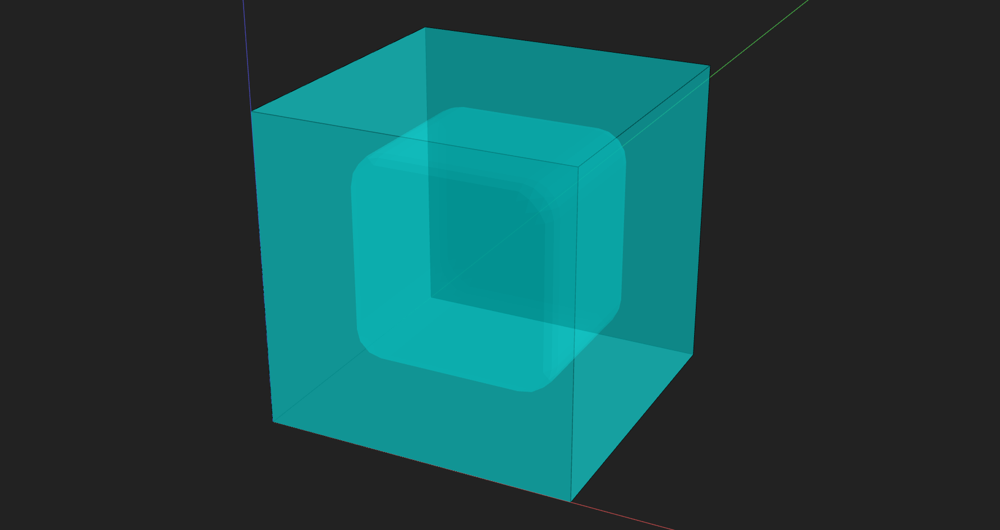
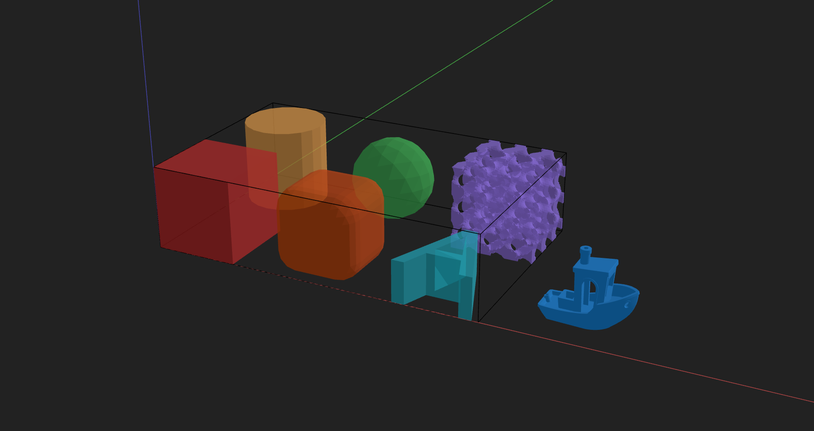

# Modeling — Bulks, Voids, and Shapes

Prev: [Part 5: Modeling Introduction](5-modeling-introduction.md)

This step starts the **Modeling** section. Thoughout the **Modeling** section you will build a device in small, readable chunks. In this step you learn about **basic shapes** as well as how **bulks** and **voids** work together.

The basic example is a **cube void inside a cube bulk**. Then we expand into a **shape gallery** that shows every supported shape type side‑by‑side.

With both of these examples, the intent is for you to preview them yourself, and try changing some of the shapes and variables to see what happens. If you change the shape, there might be a different set of parameters to use when you declare it. Try using the **"Shapes (geometry)"** section of the **Cheat Sheet**.

The values to control shape sizes and operations (like translations) are set explicitly in each shape/operation. Later, we will learn how to use variables to simplify and standardize this process.

---

## Cube in a Cube

In this example, we’ll build a cube bulk with a smaller rounded cube void inside it.

### Step 1 — Import PyMFCAD and the shapes you need

We import `pymfcad` plus the specific shapes we’ll use.

    

    

### Step 2 — Create a Device

The `Device` is the 3D canvas we build inside. The size is controlled by pixel counts (x/y), layer count (z), and physical resolution (pixel size and layer size).

    

    

### Step 3 — Add labels

Labels are named color groups used for visualization and organization. We’ll use one label for the bulk and another for the void. See the [Named Color Lists](r2-color.md) for available color names.

    

    

### Step 4 — Create the shapes

We’ll make a smaller rounded cube for the void and a larger cube for the bulk.

    

    

### Step 5 — Move the inner shape

We translate the inner shape so it sits inside the outer cube (not centered at the origin).

    

    

### Step 6 — Add the bulk and void

Bulks add material; voids remove material from bulks. The order doesn’t matter for previewing, but both must be added to the same device.

    

    

### Step 7 — Preview the result

Send the device to the visualizer so you can inspect it.

    

    

### Full cube-in-cube example

    

    

---

## Shape gallery (side‑by‑side)

This example lays out multiple shapes in a grid so you can compare them side‑by‑side.

### Step 1 — Import PyMFCAD and the shapes you need

    

    

### Step 2 — Create a Device

We use a larger canvas so all shapes can fit in a grid.

    

    

### Step 3 — Add labels

Each label gets a different color so the shapes are easy to identify.

    

    

### Step 4 — Create shapes

Notice how each shape has different parameters. This is where you can experiment with size, radius, font, or TPMS settings. For this step, we use the 3DBenchy model as an example for ImportModel. You can download it [here](https://www.thingiverse.com/thing:763622/files). Look for 3DBenchy.stl

    

    

### Step 5 — Resize the imported model

`ImportModel` usually needs to be resized to fit the canvas.

    

    

### Step 6 — Arrange the shapes in a grid

We translate each shape to a unique position so they don’t overlap.

    

    

### Step 7 — Add shapes to the device

Each shape is added as a bulk and assigned its color label.

    

    

### Step 8 — Preview the gallery

    

    

### Full shape gallery example

    

    

---

## Notes

- **Bulks** are positive material. **Voids** are subtracted from bulks.
- `TPMS` and `ImportModel` can be heavier; try smaller sizes first.

---

## Next

Next: [Part 7: Modeling Microfluidics](7-modeling-microfluidics.md)