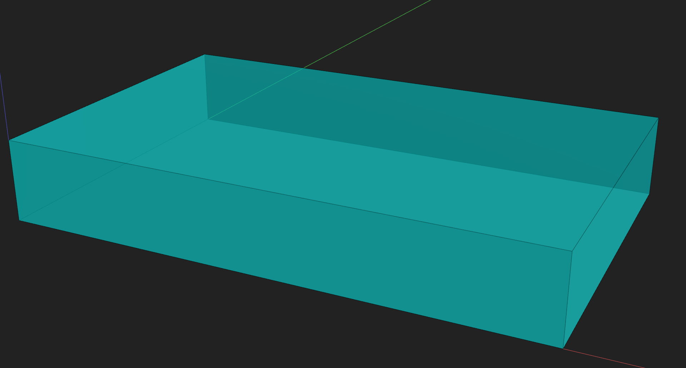
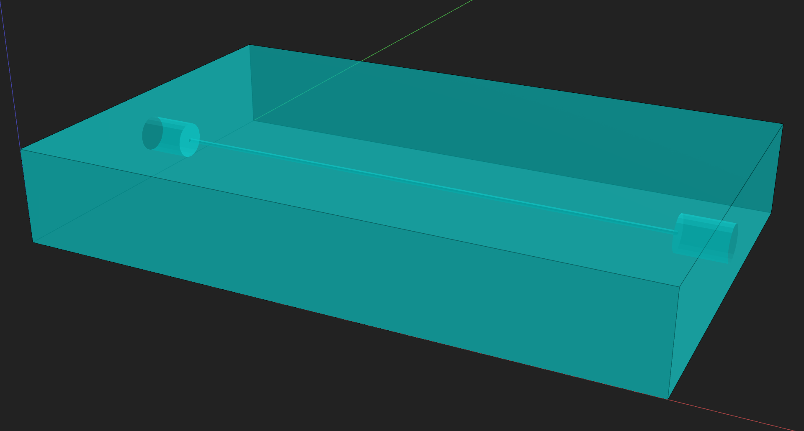
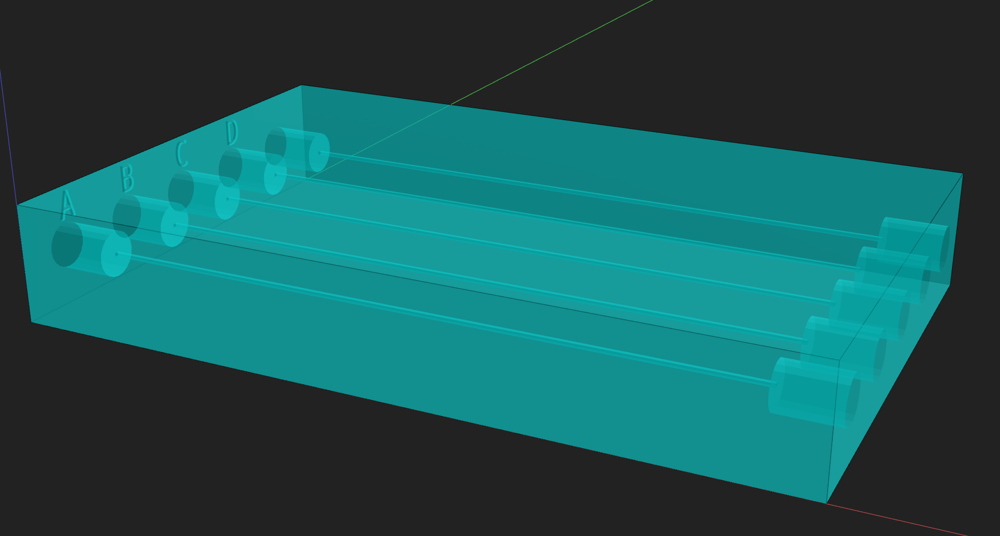

# Modeling Microfluidics

Prev: [Part 6: Modeling Bulks, Voids, and Shapes](6-modeling-bulks-voids-shapes.md)

The last step introduced **basic geometry**. Now we connect geometry to **microfluidics**!

---

## Why pixels and layers matter

**Pixel/layer resolution becomes critical when your feature sizes approach your printer’s limits**. PyMFCAD models everything in **pixels (X/Y)** and **layers (Z)** so you can design against the actual print grid and get the most accurate, repeatable results for a given printer:

- **Channel width** corresponds to a fixed number of pixels.
- **Channel height** corresponds to a fixed number of layers.
- Small features are repeatable and scalable across prints.

If you think in mm, you can always convert:

$$
\text{width}_{px} = round(\frac{\text{width}_{mm}}{\text{px\_size}}) \qquad
\text{height}_{layers} = round(\frac{\text{height}_{mm}}{\text{layer\_size}})
$$

---

## Bulk vs void = printed material vs empty space

Start with a simple picture: the final printed part begins as a solid block, and you remove material wherever fluid should flow. In PyMFCAD:

- **Bulk** is the solid resin/plastic you want to keep.
- **Void** is the empty space you remove so fluid can flow.

This means your design process is usually:

1. **Add bulk** to define the outer body of the device.
2. **Subtract voids** to carve channels, reservoirs, and access ports.

So the device you see is always **bulk minus voids**. This mental model maps directly to printing: a printer can only deposit solid material, so you must explicitly model the *absence* of material anywhere you want fluid to go. Once you internalize this, microfluidic features become straightforward—channels are just void shapes, and connections to the real world are just larger voids (like pinholes or reservoirs) that intersect those channels.

Let’s see an example.

---

## Step 1 — Device context

Before we can start modeling our device, we need to make our canvas. The `Device` defines the pixel grid and layer stack for a specific printer setup.

```python
import pymfcad

# Define constants for device dimensions and resolution
# Pixel/layer units are the core constraint for DLP‑SLA 3D printing.
PX_SIZE = 0.0076
LAYER_SIZE = 0.01

DEVICE_X = 2560
DEVICE_Y = 1600
DEVICE_Z = 300

# Create a new device (final print = bulk minus voids)
device = pymfcad.Device(
    name="example_device",
    position=(0, 0, 0),
    layers=DEVICE_Z,
    layer_size=LAYER_SIZE,
    px_count=(DEVICE_X, DEVICE_Y),
    px_size=PX_SIZE,
)


# Add labels for bulk and void regions (labels are just named color groups)
device.add_label("bulk", pymfcad.Color.from_name("aqua", 120))
device.add_label("void", pymfcad.Color.from_name("tomato", 200))


```

---

## Step 2 — Define the bulk body (the printable solid)

Start with a single bulk shape that matches the device bounds. Every channel, reservoir, or access port will be carved out as a **void** later.

```python
# Define bulk region and add it to the device
bulk = pymfcad.Cube((DEVICE_X, DEVICE_Y, DEVICE_Z))
device.add_bulk("bulk_shape", bulk, label="bulk")
```


Preview now to confirm your bulk body is correct. When you move on to the next step, **remove the previous** `device.preview()` call (or move your new code **above** the preview so there is only one preview call).

```python
device.preview()
```



---

## Step 3 — Add a simple channel (elongated cube)

Channels are usually long and thin, so we start with a rectangular void. We avoid round channels at very small widths because a few pixels can’t represent a smooth circle. We create the channel centered in X for easy placement, then translate it into position.

```python
# Define channel dimensions and position
CHANNEL_SIZE = (2560, 13, 10)
CHANNEL_POS = (0, 800, 150)

# Create a channel (centered for easy placement, then translated)
channel = pymfcad.Cube(CHANNEL_SIZE, center=True)
# Translate to absolute device coordinates (centered x, absolute y/z)
channel.translate((CHANNEL_POS[0] + CHANNEL_SIZE[0] // 2, CHANNEL_POS[1], CHANNEL_POS[2]))
device.add_void("channel", channel, label="void")
```

Preview the channel placement. **Remove the previous** `device.preview()` or keep a single preview at the bottom after this step’s code.

```python
device.preview()
```


---

## Step 4 — Connect the channel to the real world (pinholes)

Channels need **access points** for tubing or reservoirs. We model these as **large cylinders** at the ends of the channel.

Because $\text{px\_size} \ne \text{layer\_size}$, we convert the pinhole height in layers so the opening stays circular in **mm**.

```python
# Define pinhole dimensions
PINHOLE_WIDTH = 150
PINHOLE_LENGTH = 200
# Convert a physical width to layer units to keep pinholes circular in mm
PINHOLE_HEIGHT = PINHOLE_WIDTH * PX_SIZE / LAYER_SIZE

# Create pinholes and add them as voids
pinhole_a = pymfcad.Cylinder(height=1, radius=1).rotate((0, 90, 0))
# Resize to keep pinholes circular in mm (px and layer sizes differ)
pinhole_a.resize((PINHOLE_LENGTH, PINHOLE_WIDTH, PINHOLE_HEIGHT))
pinhole_a.translate((CHANNEL_POS[0], CHANNEL_POS[1], CHANNEL_POS[2]))

pinhole_b = pymfcad.Cylinder(height=1, radius=1).rotate((0, 90, 0))
# Resize to keep pinholes circular in mm (px and layer sizes differ)
pinhole_b.resize((PINHOLE_LENGTH, PINHOLE_WIDTH, PINHOLE_HEIGHT))
pinhole_b.translate((CHANNEL_POS[0] + CHANNEL_SIZE[0] - PINHOLE_LENGTH, CHANNEL_POS[1], CHANNEL_POS[2]))

device.add_void("pin_a", pinhole_a, label="void")
device.add_void("pin_b", pinhole_b, label="void")
```

---

## Step 5 — Finish the base device and preview

At this point you have a complete device: a bulk block with a channel and two pinholes carved out as voids. If you already previewed in Step 4, you can skip this or keep just **one** preview call.

```python
device.preview()
```



---

## Step 6 — Parametric design (union, loops, and conditionals)

Now we can use the shape operations to combine shapes into one unit and create variants programmatically. The goal is to **stop adding individual voids** and instead add **copies of a single parametric unit**.

### 6.1 Union the three shapes

Replace the individual void adds from Step 3 with a single void shape:

```python
# Remove these from Step 3:
# device.add_void("channel", channel, label="void")
# device.add_void("pin_a", pinhole_a, label="void")
# device.add_void("pin_b", pinhole_b, label="void")

# Combine channel and pinholes into a single parametric unit
channel_unit = channel + pinhole_a + pinhole_b
```

---

### 6.2 Use loops + if statements

We can build a small array of channels with labels **A, B, C, D, E** using a loop and a conditional. This is a simple example of parametric design: the same unit is reused, placed, and optionally annotated.

```python
# Add this before device.preview()

# Parametric toggles make it easy to explore variants without editing geometry
INCLUDE_TEXT = True

FONT_SIZE = 100
FONT_HEIGHT = 10
LABELS = ["A", "B", "C", "D", "E"]

for i, letter in enumerate(LABELS):
    offset = (0, (i-2) * 300, 0)

    unit = channel_unit.copy().translate(offset)
    device.add_void(f"channel_{letter}", unit, label="void")

    # Example conditional: only add text for the first four
    if i < 4:
        text = pymfcad.TextExtrusion(letter, height=FONT_HEIGHT, font_size=FONT_SIZE)
        text.rotate((90, 0, 90))
        text.translate((CHANNEL_POS[0], CHANNEL_POS[1] + (i-2) * 300 - 20, CHANNEL_POS[2] + PINHOLE_HEIGHT/2 + 10))
        device.add_void(f"label_{letter}", text, label="void")
```

Preview the parametric array. **Remove the previous** `device.preview()` or ensure only one preview call remains below the new code.

```python
device.preview()
```



---

## Full parameterized script

Your final code should look something like this:

```python
import pymfcad

# Define constants for device dimensions and resolution
# Pixel/layer units are the core constraint for DLP‑SLA printing.
PX_SIZE = 0.0076
LAYER_SIZE = 0.01

DEVICE_X = 2560
DEVICE_Y = 1600
DEVICE_Z = 300

# Create a new device (final print = bulk minus voids)
device = pymfcad.Device(
    name="example_device",
    position=(0, 0, 0),
    layers=DEVICE_Z,
    layer_size=LAYER_SIZE,
    px_count=(DEVICE_X, DEVICE_Y),
    px_size=PX_SIZE,
)

# Add labels for bulk and void regions (labels are just named color groups)
device.add_label("bulk", pymfcad.Color.from_name("aqua", 120))
device.add_label("void", pymfcad.Color.from_name("tomato", 200))

# Define bulk region and add it to the device
bulk = pymfcad.Cube((DEVICE_X, DEVICE_Y, DEVICE_Z))
device.add_bulk("bulk_shape", bulk, label="bulk")


# Define channel and pinhole dimensions and position
CHANNEL_SIZE = (2560, 13, 10)
CHANNEL_POS = (0, 800, 150)
PINHOLE_WIDTH = 150
PINHOLE_LENGTH = 200
# Convert a physical width to layer units to keep pinholes circular in mm
PINHOLE_HEIGHT = PINHOLE_WIDTH * PX_SIZE / LAYER_SIZE

# Create a channel (centered for easy placement, then translated)
channel = pymfcad.Cube(CHANNEL_SIZE, center=True)
# Translate to absolute device coordinates (centered x, absolute y/z)
channel.translate((CHANNEL_POS[0]+CHANNEL_SIZE[0]//2, CHANNEL_POS[1], CHANNEL_POS[2]))

# Create pinholes
pinhole_a = pymfcad.Cylinder(height=1, radius=1).rotate((0,90,0))
# Resize to keep pinholes circular in mm (px and layer sizes differ)
pinhole_a.resize((PINHOLE_LENGTH, PINHOLE_WIDTH, PINHOLE_HEIGHT))
pinhole_a.translate((CHANNEL_POS[0], CHANNEL_POS[1], CHANNEL_POS[2]))

pinhole_b = pymfcad.Cylinder(height=1, radius=1).rotate((0,90,0))
# Resize to keep pinholes circular in mm (px and layer sizes differ)
pinhole_b.resize((PINHOLE_LENGTH, PINHOLE_WIDTH, PINHOLE_HEIGHT))
pinhole_b.translate((CHANNEL_POS[0]+CHANNEL_SIZE[0]-PINHOLE_LENGTH, CHANNEL_POS[1], CHANNEL_POS[2]))

# Combine channel and pinholes into a single void region (boolean union)
channel_unit = channel + pinhole_a + pinhole_b


# Parametric toggles make it easy to explore variants without editing geometry
INCLUDE_TEXT = True

FONT_SIZE = 100
FONT_HEIGHT = 10
LABELS = ["A", "B", "C", "D", "E"]

for i, letter in enumerate(LABELS):
    offset = (0, (i-2) * 300, 0)

    unit = channel_unit.copy().translate(offset)
    device.add_void(f"channel_{letter}", unit, label="void")

    # Example conditional: only add text for the first four
    if i < 4:
        text = pymfcad.TextExtrusion(letter, height=FONT_HEIGHT, font_size=FONT_SIZE)
        text.rotate((90, 0, 90))
        text.translate((CHANNEL_POS[0], CHANNEL_POS[1] + (i-2) * 300 - 20, CHANNEL_POS[2] + PINHOLE_HEIGHT/2 + 10))
        device.add_void(f"label_{letter}", text, label="void")

# Preview the device
device.preview()

```

---

## Step 7 — Polychannel version (continuous/hulled shape)

You can build the same “two pinholes + connecting channel” as a **continuous composite shape** using a **polychannel**. A polychannel is a sequence of cross‑sections that get **hulled** together, creating smooth, continuous geometry without manual unions between every piece.

**Positioning rule:** the **first** `PolychannelShape` position is **absolute**. Every shape after that is **relative to the previous one** (unless you explicitly set `absolute_position=True`). If a property doesn’t change (like `shape_type` or `size`), you can omit it and the previous value is reused. Full shape options are documented in the API: [Polychannels](api/polychannels.md).

```python
# Polychannel basics: a path of cross-sections that are hulled together
polychannel = pymfcad.Polychannel(
    [
        pymfcad.PolychannelShape(
            shape_type="sphere",
            position=(CHANNEL_POS[0], CHANNEL_POS[1], CHANNEL_POS[2]),
            size=(0, PINHOLE_WIDTH, PINHOLE_HEIGHT),
        ),
        pymfcad.PolychannelShape(
            position=(PINHOLE_LENGTH, 0, 0),
        ),
        pymfcad.PolychannelShape(
            shape_type="cube",
            position=(0, 0, 0),
            size=(0, CHANNEL_SIZE[1], CHANNEL_SIZE[2]),
        ),
        pymfcad.PolychannelShape(
            position=(CHANNEL_SIZE[0] - PINHOLE_LENGTH * 2, 0, 0),
        ),
        pymfcad.PolychannelShape(
            shape_type="sphere",
            position=(0, 0, 0),
            size=(0, PINHOLE_WIDTH, PINHOLE_HEIGHT),
        ),
        pymfcad.PolychannelShape(
            position=(PINHOLE_LENGTH, 0, 0),
        ),
    ]
)

device.add_void("polychannel_unit", polychannel, label="void")
```


**Key idea:** each `PolychannelShape` defines a cross‑section. The library **hulls** between them, so you get a smooth, continuous channel that can change size or shape along its path.

In this example we only use a 1D layout (the path stays on the X axis). If you change direction in Y or Z, you may need a full 3D shape at that junction.

---


## Notes

- Channels should be sized in **pixels/layers** to match printer resolution.
- Pinholes are modeled as **voids** for tubing access.
- If pixel size != layer size, shapes will appear stretched. Use resize operation to reshape them.
- Union (`+`) helps you treat a group of shapes as a single parametric feature.

---

## Next

Next: [Part 8: Reusable Components](8-reusable-components.md)