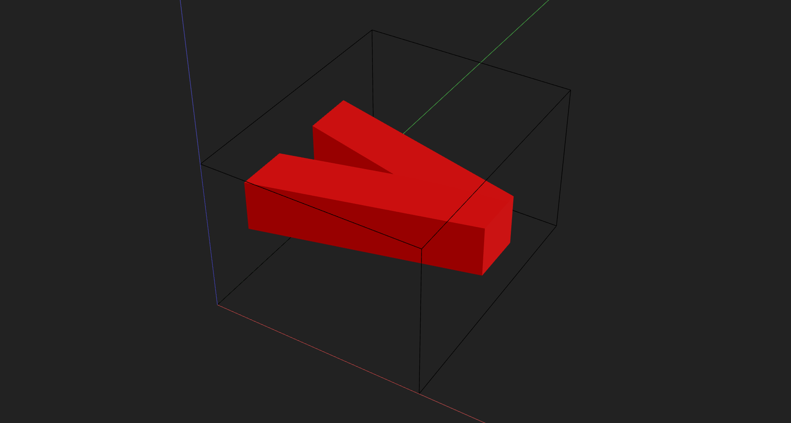
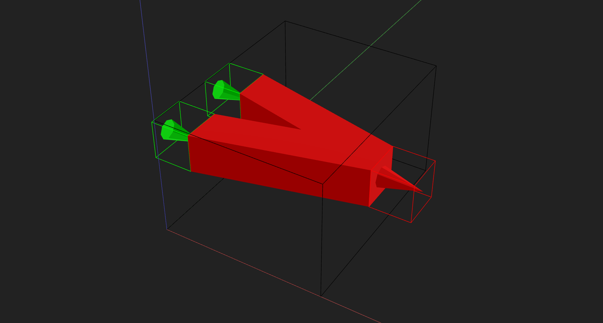

# Reusable Components

Prev: [Part 7: Modeling Microfluidics](7-modeling-microfluidics.md)

This step introduces **reusable components**. The goal is to turn a feature (like a Y‑junction) into a class you can import and place in any device.

---

## What is a custom component?

A custom component is a Python class that inherits from `Component`. Inside `__init__`, you build geometry the same way you did in earlier steps—by adding bulk, voids, labels, and ports. The difference is that now your geometry is **encapsulated**, reusable, and parameterized.

---

## Example — Y‑junction mixer

We’ll build a minimal Y‑junction in small pieces, then provide a full copy‑paste version.

## Step 1 — Create a subclass and define geometry in `__init__`

Your class should:

- Subclass `Component`.
- Accept parameters you want to expose (sizes, margins, labels, etc.).
- Store init args/kwargs for equality checks (`self.init_args`, `self.init_kwargs`).
- Call `super().__init__()` with size, position, and resolution.

Use the same API you already know: `add_label`, `add_void`, and `add_bulk`.

### 1) Imports + class skeleton

    

    

### 2) Initialize and store parameters

    

    

### 3) Labels + bulk + channel voids

    

    

### 4) Instantiate and preview (before ports)

At this stage, instantiate the component and preview it **before** adding ports so you can validate the geometry alone.

    

    

---

## Ports (what they are and why they matter)

**Ports are connection points** used by routing and device assembly. A port defines:

- **Type**: `IN`, `OUT`, or `INOUT`
- **Position**: where the port starts
- **Size**: channel size at that port
- **Normal**: the direction the port faces

Even before you learn routing, adding ports makes your component reusable and connectable.

### 5) Ports

    

    

### 6) Instantiate and preview (after ports)

Now instantiate and preview again **after** ports are added. This confirms the ports did not affect geometry and the component is ready for routing.

---

## Full example

    

    

---

## Notes

- Keep custom components in their own Python files so they’re easy to import.
- Use `self.init_args` / `self.init_kwargs` to make components comparable and cacheable.
- Ports make your component connectable for routing later.

---

## Next

Next: [Part 9: Routing with Fractional Paths](9-routing-fractional.md)
