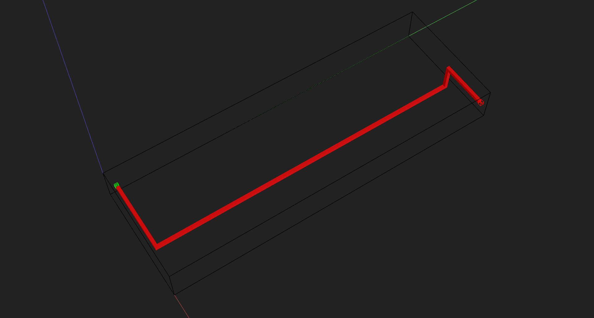
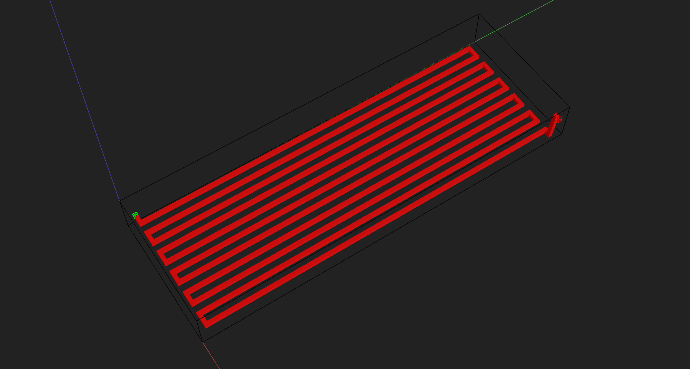
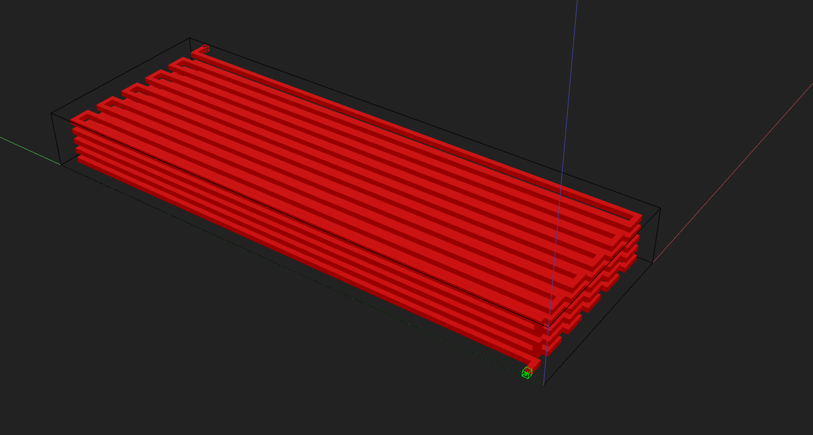

# Routing with Fractional Paths

Prev: [Part 8: Reusable Components](8-reusable-components.md)

This step introduces **routing**. We’ll focus on **fractional routing** (manual control) and build a **serpentine channel** as a reusable custom component.

---

## What is routing?

Routing connects **ports** with channels. Instead of manually placing a long chain of shapes, you define the **start port**, **end port**, and a **path**, and the router builds the channel geometry for you.

In this step we use **fractional routing**, which means you define the path as a set of **relative steps** that add up to the end point.

---

## Router class (high‑level idea)

The `Router`:

- Knows your component and its ports
- Builds channels with a fixed cross‑section (`channel_size`)
- Keeps a safety margin (`channel_margin`) to prevent collisions
- Collects route requests and then **finalizes** them into geometry

---

## Fractional routing (how it works)

You pass a list of **steps**. Each step is a fractional movement along the vector from start to end. For example:

```python
fractional_path = [
    (0.0, 0.3, 1.0),
    (0.4, 0.0, 0.0),
    (0.0, 0.3, 0.0),
    (0.6, 0.0, 0.0),
    (0.0, 0.4, 0.0),
]
```

The total of each axis should sum to **1.0** (so you end exactly at the target port). Negative values are allowed if you need to double back.

---

## Example — Serpentine component (fractional routing)

We’ll build a serpentine channel as a reusable component. This version is **parameterized** (e.g., `width`, `loops`, `levels`) and generates the **fractional path dynamically**, so you can scale the channel without rewriting the route list.

### 1) Imports + class skeleton

```python
import inspect
from pymfcad import Component, Port, Router, Color, Cube


class SerpentineChannel(Component):
    """
    Simple serpentine channel with two ports.
    """
```

### 2) Initialize, labels, bulk, and ports

```python
    def __init__(
        self,
        channel_size=(8, 8, 6),
        channel_margin=(16, 16, 6),
        width=800,
        loops=11,
        levels=5,
        px_size=0.0076,
        layer_size=0.01,
        quiet=False,
    ):
        frame = inspect.currentframe()
        args, _, _, values = inspect.getargvalues(frame)
        self.init_args = [values[arg] for arg in args if arg != "self"]
        self.init_kwargs = {arg: values[arg] for arg in args if arg != "self"}

        # Overall component dimensions (bulk size)
        x_dim = channel_size[0] * loops + channel_margin[0] * (loops + 1)
        y_dim = width
        z_dim = channel_size[2] + 2 * channel_margin[2]

        super().__init__(
            size=(x_dim, y_dim, z_dim),
            position=(0, 0, 0),
            px_size=px_size,
            layer_size=layer_size,
            quiet=quiet,
        )

        # Labels define which geometry is solid vs. empty
        self.add_label("bulk", Color.from_name("aqua", 127))
        self.add_label("void", Color.from_name("red", 255))

        # The device starts as a solid block
        self.add_bulk("bulk_shape", Cube(self._size, center=False), label="bulk")

        # Ports define where routing starts/ends
        self.add_port(
            "inlet",
            Port(
                Port.PortType.IN,
                (0, channel_margin[1], channel_margin[2]),
                channel_size,
                Port.SurfaceNormal.NEG_X,
            ),
        )
        self.add_port(
            "outlet",
            Port(
                Port.PortType.OUT,
                (x_dim, y_dim - 2 * channel_margin[1], channel_margin[2]),
                channel_size,
                Port.SurfaceNormal.POS_X,
            ),
        )
```

### 3) Simple routing first (one easy path)

Start with a very simple route so you can see how fractional steps work. **After you preview this, remove this block** and replace it with the serpentine routing in the next step.

```python
        # Router builds the void geometry from a path
        router = Router(self, channel_size=channel_size, channel_margin=channel_margin)

        # Simple fractional path: go straight in X, then offset in Y, then finish in X
        # X fractions must sum to 1.0, Y fractions must sum to 1.0, Z fractions to 0.0
        simple_path = [
            (0.6, 0.0, 0.0),  # move mostly along X
            (0.0, 1.0, 0.0),  # shift to the outlet's Y
            (0.4, 0.0, 0.0),  # finish X to reach the outlet
        ]

        router.route_with_fractional_path(self.inlet, self.outlet, simple_path, label="void")
        router.finalize_routes()
```

Preview this simple route before moving on. **Remove the previous preview** (or keep only one preview block at the bottom) when you proceed to the next step.

```python
if __name__ == "__main__":
    SerpentineChannel().preview()
```



### 4) Replace with a 2D serpentine (one level)

Now **remove the simple routing block above** and use a **single‑layer** serpentine (no Z moves). This helps you learn the pattern before stacking levels.

```python
        # Router builds the void geometry from a path
        router = Router(self, channel_size=channel_size, channel_margin=channel_margin)

        # Build a 2D serpentine path (Z stays at 0.0)
        x_steps = loops * 2 + 1
        x_step = 1.0 / x_steps

        serpentine = []
        direction = 1
        for loop in range(loops):
            # Move along X into the next segment
            if loop != 0:
                serpentine.append((direction * x_step, 0.0, 0.0))

            # Sweep across Y (up/down alternates each loop)
            y_dir = 1 if loop % 2 == 0 else -1
            serpentine.append((0.0, direction * y_dir, 0.0))

            # Move along X again to complete the loop
            if loop != loops - 1:
                serpentine.append((direction * x_step, 0.0, 0.0))

        # Final X step to land exactly on the outlet
        serpentine.append((x_step, 0.0, 0.0))

        router.route_with_fractional_path(self.inlet, self.outlet, serpentine, label="void")
        router.finalize_routes()
```

Preview the 2D serpentine. **Remove the previous preview** (or keep just one preview block) before you move to the 3D version.

```python
if __name__ == "__main__":
    SerpentineChannel().preview()
```



### 5) Replace with the full 3D serpentine (stacked levels)

Now **remove the 2D serpentine above** and add Z steps to stack multiple levels.

```python
        # Router builds the void geometry from a path
        router = Router(self, channel_size=channel_size, channel_margin=channel_margin)

        # Build a fractional serpentine path.
        # Each tuple is a fraction of the *total* vector from inlet to outlet.
        # All X fractions must sum to 1.0, same for Y and Z.
        total_height = (channel_size[2] + channel_margin[2]) * (levels - 1)
        layer_step = (channel_size[2] + channel_margin[2]) / total_height if levels > 1 else 0.0

        # We split X into small steps: left/right moves + a final nudge to reach the outlet
        x_steps = loops * 2 + 1
        x_step = 1.0 / x_steps

        serpentine = []
        for layer in range(levels):
            # Alternate direction each layer (zig-zag)
            direction = 1 if layer % 2 == 0 else -1

            for loop in range(loops):
                # Move along X into the next segment
                if layer == 0 or loop != 0:
                    serpentine.append((direction * x_step, 0.0, 0.0))

                # Sweep across Y (up/down alternates each loop)
                y_dir = 1 if loop % 2 == 0 else -1
                serpentine.append((0.0, direction * y_dir, 0.0))

                # Move along X again to complete the loop
                if layer == levels - 1 or loop != loops - 1:
                    serpentine.append((direction * x_step, 0.0, 0.0))

            # Step up in Z between levels (except after the last one)
            if layer != levels - 1:
                serpentine.append((0.0, 0.0, layer_step))

        # Final X step to land exactly on the outlet
        serpentine.append((x_step, 0.0, 0.0))

        router.route_with_fractional_path(self.inlet, self.outlet, serpentine, label="void")
        router.finalize_routes()
```

    Preview the full 3D serpentine. If you already added a preview above, **remove it** so only one preview call remains.

### 6) Preview

```python
if __name__ == "__main__":
    SerpentineChannel().preview()

```



---

## Full example (copy/paste)

The full script below combines the component setup, ports, and routing into one file so you can run it directly and preview the channel.

```python
### SERPENTINE CHANNEL COMPONENT

import inspect
from pymfcad import Component, Port, Router, Color, Cube


class SerpentineChannel(Component):
    """
    Simple serpentine channel with two ports.
    """

    def __init__(
        self,
        channel_size=(8, 8, 6),
        channel_margin=(8, 8, 6),
        width=800,
        loops=11,
        levels=5,
        px_size=0.0076,
        layer_size=0.01,
        quiet=False,
    ):
        frame = inspect.currentframe()
        args, _, _, values = inspect.getargvalues(frame)
        self.init_args = [values[arg] for arg in args if arg != "self"]
        self.init_kwargs = {arg: values[arg] for arg in args if arg != "self"}

        # Overall component size (bulk)
        length = channel_size[0] * loops + channel_margin[0] * (loops + 1)

        super().__init__(
            size=(length, width, channel_size[2]*levels + channel_margin[2]*(levels + 1)),
            position=(0, 0, 0),
            px_size=px_size,
            layer_size=layer_size,
            quiet=quiet,
        )

        # Labels define which geometry is solid vs empty
        self.add_label("bulk", Color.from_name("aqua", 127))
        self.add_label("void", Color.from_name("red", 255))

        # Start with a solid block
        self.add_bulk("bulk_shape", Cube(self._size, center=False), label="bulk")

        # Ports define start/end for routing
        self.add_port(
            "inlet",
            Port(
                Port.PortType.IN,
                (0, channel_margin[1], channel_margin[2]),
                channel_size,
                Port.SurfaceNormal.NEG_X,
            ),
        )
        self.add_port(
            "outlet",
            Port(
                Port.PortType.OUT,
                (length, width - 2 * channel_margin[1], levels*(channel_margin[2] + channel_size[2]) - channel_margin[2]),
                channel_size,
                Port.SurfaceNormal.POS_X,
            ),
        )

        # Router converts a fractional path into void geometry
        router = Router(self, channel_size=channel_size, channel_margin=channel_margin)

        # Build a clear, commented fractional serpentine path.
        total_height = (channel_size[2] + channel_margin[2]) * (levels - 1)
        layer_step = (channel_size[2] + channel_margin[2]) / total_height if levels > 1 else 0.0

        x_steps = loops * 2 + 1
        x_step = 1.0 / x_steps

        serpentine = []
        for layer in range(levels):
            direction = 1 if layer % 2 == 0 else -1  # alternate left/right each layer

            for loop in range(loops):
                # Move along X into a segment
                if layer == 0 or loop != 0:
                    serpentine.append((direction * x_step, 0.0, 0.0))

                # Sweep across Y (alternating up/down)
                y_dir = 1 if loop % 2 == 0 else -1
                serpentine.append((0.0, direction * y_dir, 0.0))

                # Move along X again
                if layer == levels - 1 or loop != loops - 1:
                    serpentine.append((direction * x_step, 0.0, 0.0))

            # Step up in Z between levels
            if layer != levels - 1:
                serpentine.append((0.0, 0.0, layer_step))

        # Final X step to end exactly at the outlet
        serpentine.append((x_step, 0.0, 0.0))

        router.route_with_fractional_path(self.inlet, self.outlet, serpentine, label="void")
        router.finalize_routes()

if __name__ == "__main__":
    SerpentineChannel().preview()
```

---

## Notes

- Fractional steps should sum to 1.0 on each axis.
- Negative steps are fine for back‑and‑forth paths like serpentines.
- Routing builds channels as voids; bulk is still added separately.

---

## Next

Next: [Part 10: Using Components in a Device](10-using-components.md)