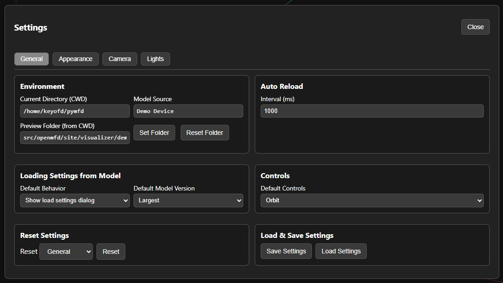
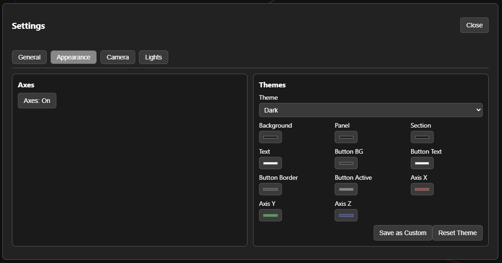
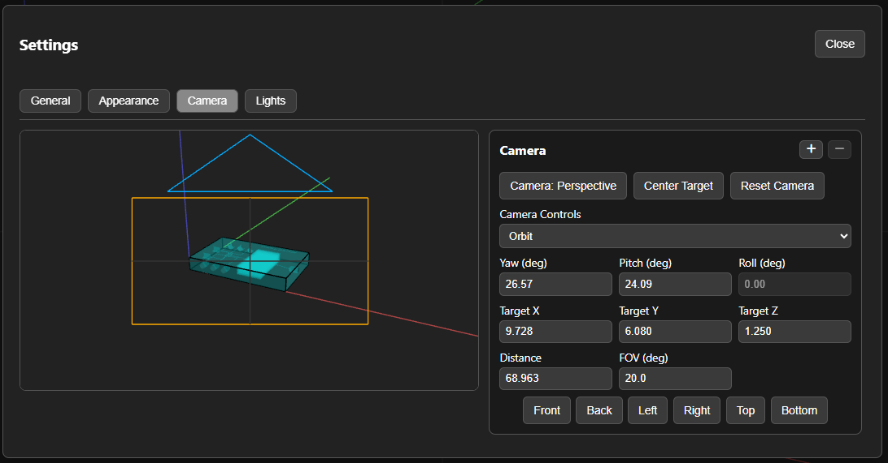
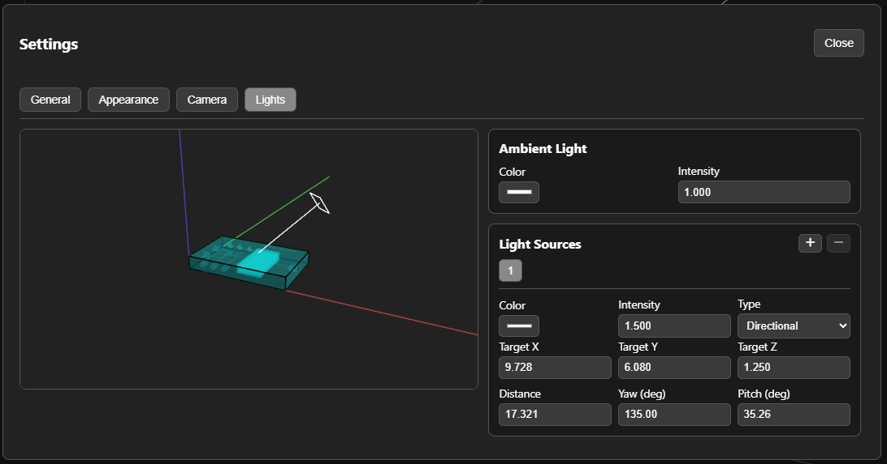
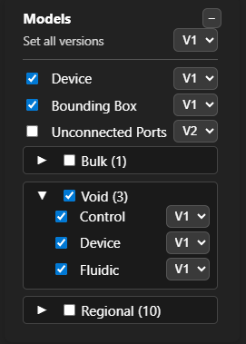
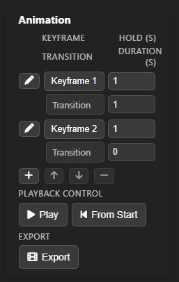
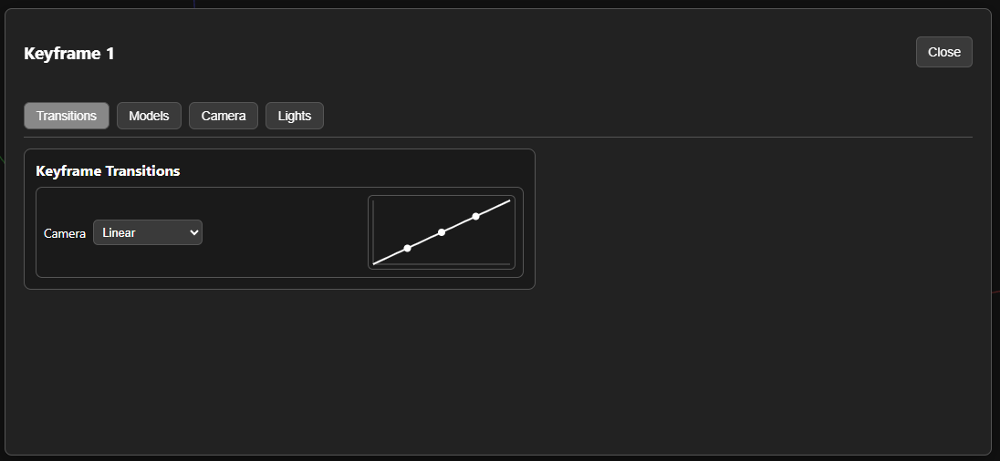
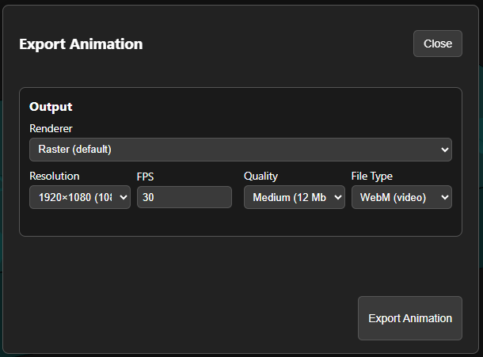

# Advanced Visualizer Topics

Prev: [Part 3: Using the Visualizer](3-visualizer.md)

This page covers advanced features of the visualizer that are not required for the main tutorial.

## Visualizer Settings

All visualizer settings live in the **Settings** dialog. The tabs below cover general behavior, appearance/theme controls, camera configuration, and lighting.

### General tab (scene-related items)

The **General** tab includes settings that affect the viewing experience:

- **Environment** — select the model folder. By default, the visualizer uses `_visualization` under the current working directory (CWD); if that is missing, it falls back to the demo device. You can select a different folder inside the CWD.
- **Model settings behavior** — change the default behavior when loading a model (show the Load Settings dialog, ignore model settings, or auto‑apply camera/lighting/animation settings).
- **Default model version** — choose Smallest or Largest when multiple versions exist.
- **Reset settings** — reset specific groups of settings (General, Theme, Camera, Lighting, Animation) or all settings.
- **Auto Reload** — interval for refreshing preview output.
- **Default controls** — choose Orbit or Trackball.
- **Save and Load Settings** — save the current visualizer settings to a file or manually open the Load Settings dialog.

### Appearance tab

The **Appearance** tab is helpful for consistent screenshots and presentations:

- Toggle **Axes** on/off.
- Choose a **Theme** (Dark, Light, or Custom).
- Customize background, panel, and text colors; then save or reset the theme.

### Camera tab

The **Camera** tab provides a precise way to position and store cameras.

- **Saved cameras list** — stored camera slots used by the toolbar and keyframes.
- **Camera mode** — toggle between Perspective and Orthographic.
- **Center Target** — centers the camera target on the visible model.
- **Reset Camera** — frames the visible model using the current camera mode.
- **Camera controls** — switch between Orbit and Trackball control styles.
- **Numeric controls** — edit yaw, pitch, roll, target position, distance, and FOV.
- **Presets** — quick Front/Back/Left/Right/Top/Bottom views.

Tip: When the **Camera** tab is open, double‑clicking in the preview pane sets the camera target to the clicked surface point.

### Lights tab

The **Lights** tab manages ambient light plus any number of directional or spot lights.

- **Ambient light** — color and intensity for overall illumination.
- **Light sources list** — select a light, then edit its properties.
- **Type** — choose Directional or Spot (type changes are limited during keyframe editing; see Animation below).
- **Target + orientation** — edit target position (X/Y/Z) or set yaw/pitch + distance.
- **Spotlight options** — range, decay, cone angle, and penumbra.

Tip: When the **Lights** tab is open, double‑clicking in the preview pane sets the active light target to the clicked surface point.

## Loading multiple versions of models

The visualizer supports **versioned models**. If a model has multiple versions, the **Model Selector** shows a version dropdown next to its name. When multiple models share common versions, a **Set all versions** selector appears at the top.

Key points:

- Versions are grouped by base name (for example, names like `device__v2` become version `V2`).
- The **Default model version** setting (General tab) selects the initial version (Smallest or Largest).
- You can mix versions across models to compare geometry changes side‑by‑side.
- Versioned models are especially useful for advanced animations and comparisons over time.

## Using the animation system

The **Animation** panel builds camera fly‑throughs and repeatable inspections using keyframes.

### Keyframes

- **Add** creates a keyframe containing the current **camera**, **lighting**, and **model visibility/version** state.
- **Hold (s)** controls how long the keyframe is held.
- **Transition Duration (s)** controls the time to the next keyframe.
- **Move Up/Down** reorders keyframes; **Remove** deletes the active keyframe.

Selecting a keyframe applies its camera, lighting, and model visibility immediately.

### Editing transitions and model visibility

Click the **pencil icon** on a keyframe to open the Settings dialog in **Keyframe mode**. This exposes four tabs:

- **Transitions** — choose how **Camera**, **Lighting**, and **Models** interpolate to the next keyframe. Available options include On start, In middle, On end, Linear, and S‑curve. The curve editor is available for Linear and S‑curve transitions.
- **Models** — the Model Selector appears inside the dialog so you can choose which models (and versions) are visible for that keyframe.
- **Camera** — edit the camera pose, controls, and presets for the active keyframe.
- **Lights** — edit ambient and directional/spot lights for the active keyframe.

Notes:

- **Camera mode** (Perspective/Orthographic) and **light structure** (add/remove/type) can only be changed in **Keyframe 1**. Later keyframes can still adjust positions and values.
- Model version changes can cross‑fade during transitions.

### Playback and export

- **Play** toggles play/pause from the active keyframe.
- **From Start** starts playback from keyframe 1.
- **Export** opens the export dialog with renderer, resolution, FPS, and quality controls.

---

Next: [Part 4: Hello World Component](4-building_first_component.md)
