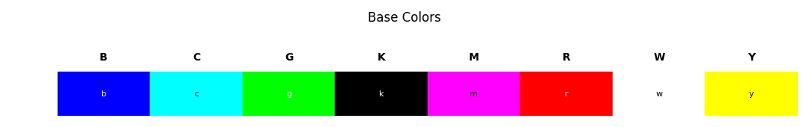
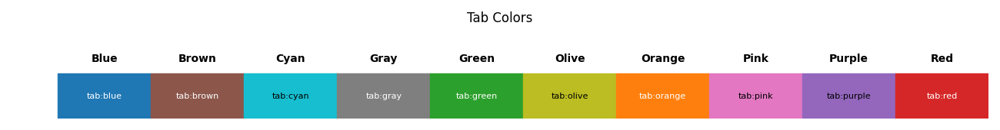
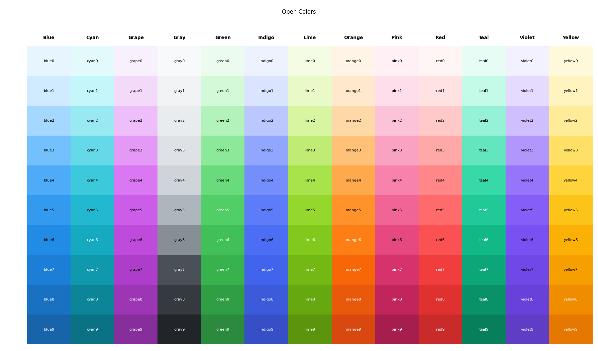
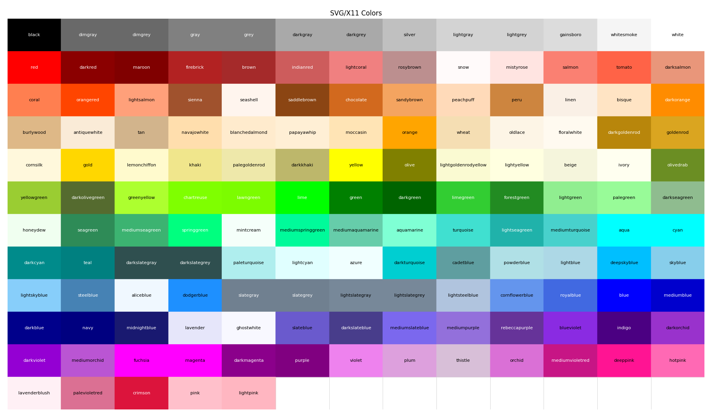
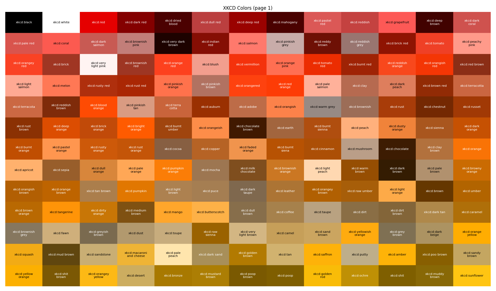
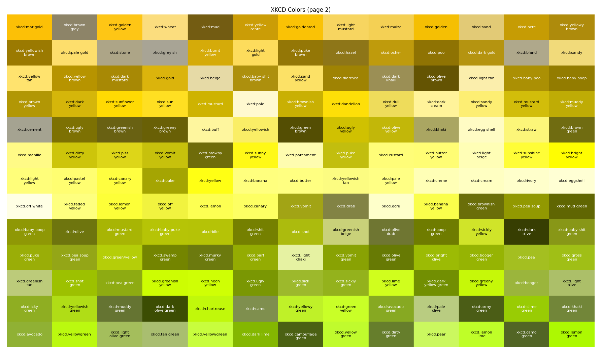
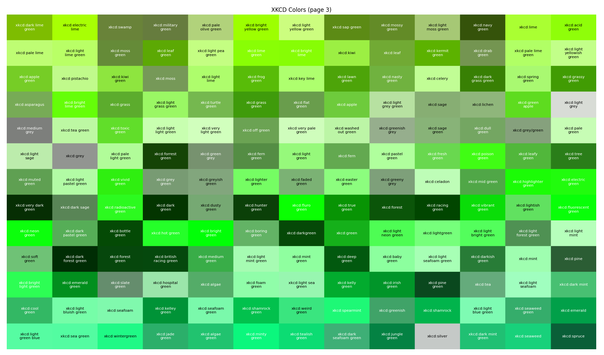
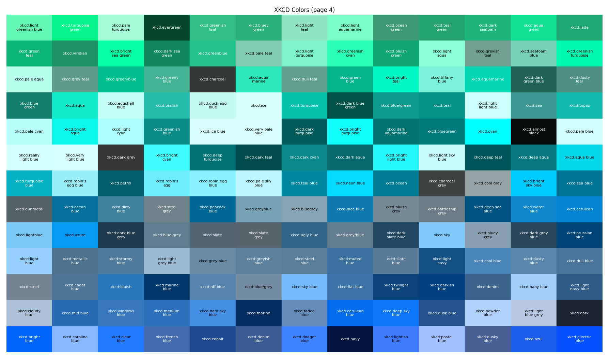
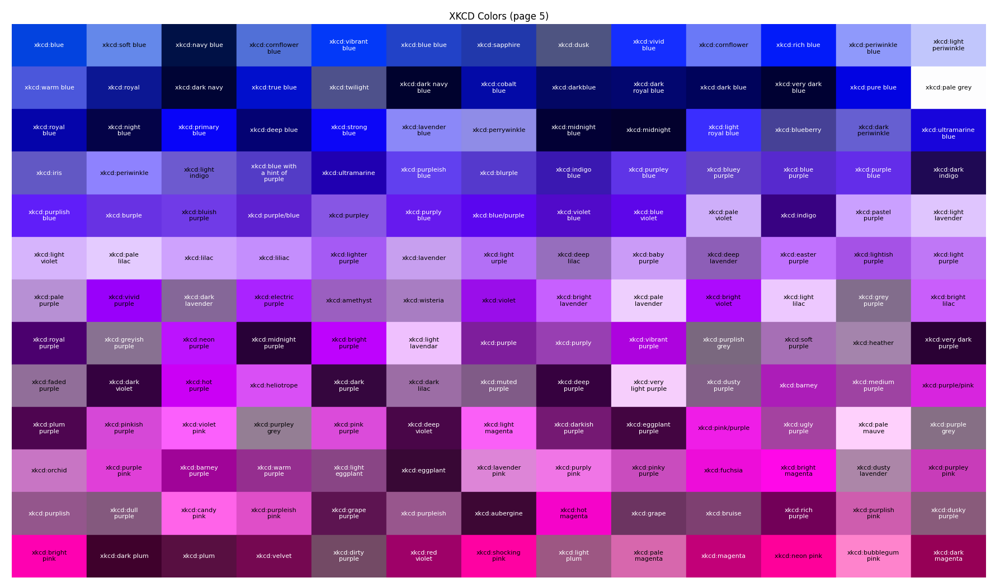
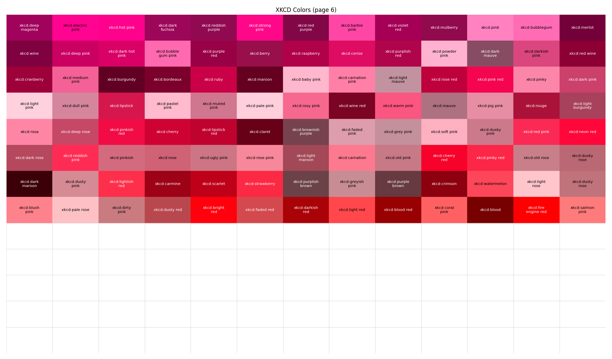

# Supported Color Palettes
This section describes the named color palettes available in PyMFCAD. These palettes are designed to support a variety of visualization and design requirements.

## Base Colors

## Tableau Colors

These can also be referenced using the names c0, c1...
## Open Colors

## SVG/X11 Colors

## XKCD Colors
PyMFCAD also supports colors from the [xkcd color survey](https://xkcd.com/color/rgb/), e.g. "xkcd:sky blue".

